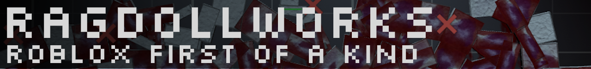

# 📚 Ragdollworks
A Roblox 2D sandbox featuring spawnable objects in various sandbox maps, wiring, simulated humans, physics, machinery, explosions, and more.

In other words, a cheap ripoff of People Playground.

## ❔ | What's "Rage"?
Rage is the foundation of this game. It serves as a "bootloader" by allowing the creation of services and loading them based on a manually-set (and automatically) priority order. Since it serves as a bootloader, it also allows for using single-script architecture.

Rage will eventually get its own repo and will be fully open-sourced.

## 👷‍♂️ | Setup
### Prerequisites
1) [Aftman](https://github.com/LPGhatguy/aftman)
2) (Optional) [Roblox LSP Extension](https://marketplace.visualstudio.com/items?itemName=Nightrains.robloxlsp). I do not use the successor Luau extension because I've ran into too many quirks using it on this project.

### Steps
1) `git clone` this repo.
2) `cd` into the repo folder.
3) Install all tools via `aftman install`. This will install all tools used in this game like Wally and Rojo.
4) Run `wally install`. This will install all Wally packages used in this game.
5) Run `rojo serve`. This will allow you to synchronise code from the repo to the game itself in Roblox Studio.
6) [Ask me personally](https://discord.com/users/1141077132915777616) for the game's Roblox place file. It is not publicly available to prevent copycat games.
7) Open it up in Roblox Studio.
8) Install the `Rojo` plugin in Roblox Studio.
9) Open up `Rojo` in Roblox Studio and click "Connect". Code should now sync from the repo directory to the game allowing you to code in VSCode.

## 📸 | Game Screenshots


## 🤬 | Rants
- Luau LSP is the most up-to-date LSP for Roblox, but I can't use it because it can't infer types through references (e.g: `require(Rage.Path.ID)` is an unknown type). Stuck with Roblox LSP that can do this but is outdated and most packages don't support types for it. Fuck
- Roblox LSP: Given two files `foo.luau` and `bar.luau`, if `foo` requires `bar`, and another file called `main.luau` requires `foo` and `bar`, the types in `bar` will get all fucked and can't be used in `main.luau`. The LSP knows its there and even shows that, but it will not provide things like auto-completion when indexing a table of the type. Fuck 

## ©️ | License
```
Source-Available No-Redistribution License
Copyright (c) 2025 Cuh4. All rights reserved.

IMPORTANT: This source code is NOT Open Source.

1. PERMISSIONS (Limited):
* View and read the source code.
* Modify for private, non-public use only.
* Contributions back to the project are permitted.

2. PROHIBITIONS (Strict):
* You MAY NOT copy, redistribute, publish, or share the code (modified or unmodified).
* You MAY NOT use this code in ANY public or commercial project or service.

Any violation automatically terminates your rights.
Provided "AS IS" without warranty.
Full terms governed by the laws of England and Wales.
```
See `LICENSE` file for a more detailed version.